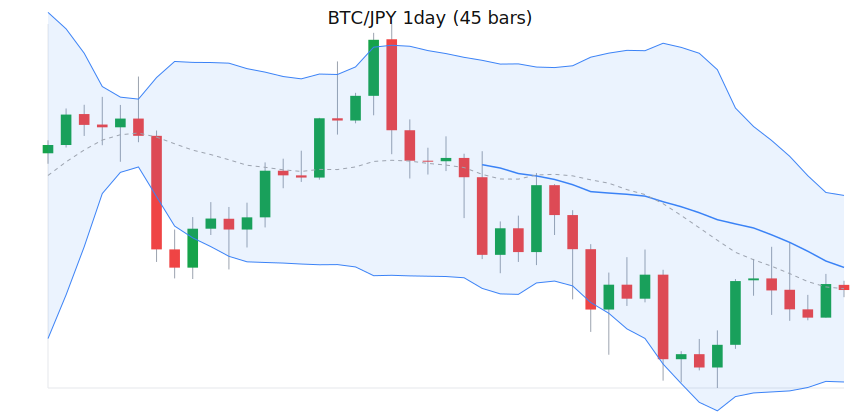

# bitbank-mcp-server

本サーバーは MCP (Model Context Protocol) 対応のクライアント（例: Claude, MCP Inspector）から直接呼び出すことで、bitbank API のデータ取得やテクニカル分析を行えるツールです。

## 主な機能

- **リアルタイムデータ取得**: ティッカー（現在価格）、オーダーブック（板情報）
- **履歴データ取得**: ローソク足（1分足〜月足）
- **テクニカル分析**:
  - 移動平均線 (SMA: 25, 75, 200)
  - 相対力指数 (RSI: 14)
  - ボリンジャーバンド
  - 一目均衡表
  - 自動トレンド分析
  - **チャート描画**:
    - `render_chart_svg`: ローソク足チャートを静的なSVG画像として生成します。JavaScriptを使用しないため、Claudeのようなセキュリティ制約の厳しい環境でも確実な表示が保証されます。
    - `render_chart_html`: ローソク足チャートをインタラクティブなHTMLファイルとして生成します。高機能ですが、クライアント環境のセキュリティポリシー(CSP)によっては表示されない場合があります。

### サンプルチャート (SVG)

以下は `render_chart_svg` ツールによって生成されたBTC/JPYの日足チャートです。

**ボリンジャーバンド**


**一目均衡表**


> **Note:** `render_chart_html` はインタラクティブですが、実行環境の CSP でブロックされる場合があります。安定表示が必要な場合は `render_chart_svg` を使用してください。

## 制約事項

Claude（MCPホスト）経由でローソク足チャートを描画する場合、
出力サイズの制限により **30〜40本程度** が安定動作の上限です。
それ以上の長期データを描画する場合は、CLI版 (`render_chart_svg_cli.mjs`) を利用し、
SVGファイルとして出力してください。

## Setup

1.  **環境変数を設定してください**  
    `.env.example` をコピーして `.env` ファイルを作成します。
    ```bash
    cp .env.example .env
    ```
    必要に応じて `.env` ファイル内の値を調整してください。
    - `PORT`: サーバーのポート番号（注: 現在の実装では `stdio` 通信のため使用されません）
    - `LOG_DIR`: ログファイルを保存するディレクトリ
    - `LOG_LEVEL`: ログの出力レベル（`info`, `debug` など）

## サーバーの起動方法

### Docker を利用する場合（推奨）

1.  **Dockerイメージをビルド**
    ```bash
    docker build -t bitbank-mcp .
    ```

2.  **コンテナを起動し、Inspectorに接続**
    ```bash
    npx @modelcontextprotocol/inspector docker run -i --rm bitbank-mcp
    ```
    上記コマンドを実行すると、コンテナが起動し、自動的にブラウザでMCP Inspectorが開きサーバーに接続されます。

    **Note: 実行ログの保存**
    
    コンテナ内で実行されたツールのログを、ホストマシン（あなたのPC）の`./logs`ディレクトリに保存したい場合は、`-v`オプション（ボリュームマウント）を追加してコンテナを起動してください。

    ```bash
    npx @modelcontextprotocol/inspector docker run -i --rm -v "$(pwd)/logs:/app/logs" bitbank-mcp
    ```

3.  **ログの確認手順**
    
    `-v`オプション付きでコンテナを起動し、Inspectorからツールをいくつか実行した後、**別のターミナル**から以下のコマンドでログを確認できます。

    ```bash
    # ログファイルが作成されているか確認
    ls logs/

    # ログファイルの中身を確認
    cat logs/$(date +%F).jsonl
    ```

### ローカル環境で直接実行する場合

1.  **依存パッケージのインストール**
    ```bash
    npm install
    ```

2.  **Inspector に接続してサーバーを起動**
    ```bash
    npx @modelcontextprotocol/inspector node src/server.mjs
    ```
    このコマンドを実行すると、サーバーが起動し、自動的にMCP Inspectorが開いて接続されます。実行ログは`.env`で指定された`LOG_DIR`（デフォルト: `./logs`）に保存されます。

## CLIツールとしての使用方法

各ツールは、サーバーを起動せずに直接コマンドラインから実行することも可能です。

### ローソク足データ取得
```bash
# 1時間足データ（YYYYMMDD形式）
node tools/get_candles_cli.mjs btc_jpy 1hour 20240511
```

### インジケーター計算
```bash
# 日足データでインジケーター計算
node tools/get_indicators_cli.mjs btc_jpy 1day
```

### SVGチャート生成
```bash
# 日足チャートをSVGファイルとして出力
node tools/render_chart_svg_cli.mjs btc_jpy 1day 45 > chart.svg
```

インジケータの表示を制御するには、以下のフラグを追加します。

- `--with-ichimoku`: 一目均衡表を描画（デフォルト: オフ）
- `--no-bb`: ボリンジャーバンドを非表示（デフォルト: オン）
- `--no-sma`: SMA（単純移動平均線）を非表示（デフォルト: オン）

**実行例：一目均衡表のみを100日分描画**
```bash
node tools/render_chart_svg_cli.mjs btc_jpy 1day 100 --with-ichimoku --no-bb --no-sma > assets/ichimoku_sample.svg
```

### ティッカーデータ取得
```bash
node tools/get_ticker.js btc_jpy
```