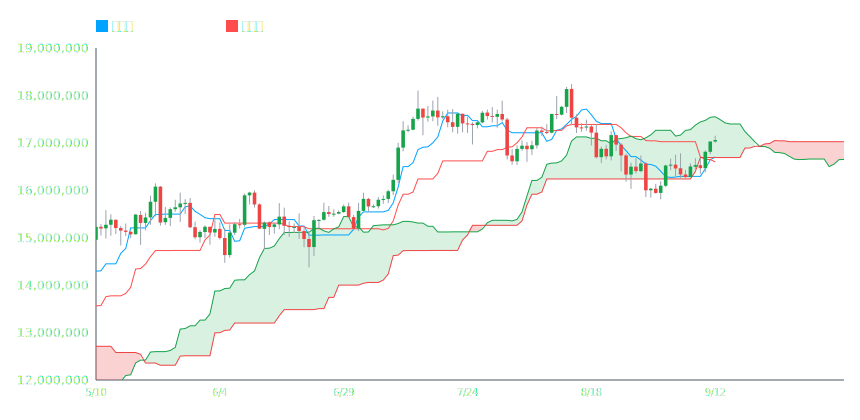

# bitbank-mcp-server

本サーバーは MCP (Model Context Protocol) 対応のクライアント（例: Claude, MCP Inspector）から直接呼び出すことで、bitbank API のデータ取得やテクニカル分析を行えるツールです。

> Note: AIの動作ポリシーは `.cursorrules`（開発メモ）と `.mcphostrules`（MCPホスト向けメモ）に記載しています。既定は常に default（標準）。extended はユーザーが明示した場合のみ許可します。ツールとプロンプトの正規仕様は `description.json` / `prompts.json` にもエクスポートしています。

## 主な機能

- **リアルタイムデータ取得**: ティッカー（現在価格）、オーダーブック（板情報）
- **履歴データ取得**: ローソク足（1分足〜月足）
- **テクニカル分析**:
  - 移動平均線 (SMA: 25, 75, 200)
  - 相対力指数 (RSI: 14)
  - ボリンジャーバンド
  - 一目均衡表
  - 自動トレンド分析
  - **チャート描画**:
    - `render_chart_svg`: ローソク足チャートを静的なSVG画像として生成します。JavaScriptを使用しないため、Claudeのようなセキュリティ制約の厳しい環境でも確実な表示が保証されます。
    - `render_chart_html`: （当面サポート外）インタラクティブHTML生成は運用要件外のため削除しました。SVG をご利用ください。

### チャート描画の重要ポリシー（必読）

- **チャートを表示する場合、必ず `tools/render_chart_svg.js`（Node API: `renderChartSvg(options)`）を使用してください。**
  - AI/クライアント側で独自の描画ロジック（D3/Canvas/Chart.js/SVG 生生成等）を実装してはいけません。
  - Artifact/Inspector では、本ツールの返す `data.svg` をそのまま表示してください。
- **Bollinger Bands の描画仕様**
  - 軽量版（既定）: ±2σ のみを描画（bbMode=`default` / `light`）。
  - 完全版（オプション）: ±1σ, ±2σ, ±3σ を描画（bbMode=`extended` / `full`）。
- **一目均衡表の描画仕様**
  - 標準: 転換線・基準線・雲（先行スパンA/B）。
  - 拡張: 上記に加え遅行スパン（`ichimoku.mode=extended` または `ichimoku.withChikou=true`）。
- **SMA の描画仕様**
  - 既定: 25/75/200 を描画。
  - 一目均衡表を描画する場合（withIchimoku=true）は、SMAとBBは強制的にオフ（実装で排他制御）。

CLI 例: `node tools/render_chart_svg_cli.mjs <pair> <type> <limit> --bb-mode=light` / `--bb-mode=full`

### サンプルチャート (SVG)

以下は `render_chart_svg` ツールによって生成されたBTC/JPYの日足チャートです。

**ボリンジャーバンド**


**一目均衡表**


> **Note:** `render_chart_html` はインタラクティブですが、実行環境の CSP でブロックされる場合があります。安定表示が必要な場合は `render_chart_svg` を使用してください。
> 追記: `render_chart_html` は当面サポート外につき削除済みです。

### プロンプトとCLIの対応表（抜粋）

| Prompt 名 | 概要 | 対応CLIフラグ例 |
|---|---|---|
| `bb_light_chart` | BB軽量（±2σ） | `--bb-mode=light` |
| `bb_full_chart` | BB完全（±1/±2/±3σ） | `--bb-mode=full` |
| `ichimoku_default_chart` | 一目 標準（遅行なし） | `--with-ichimoku --ichimoku-mode=default` |
| `ichimoku_extended_chart` | 一目 拡張（遅行スパン含む） | `--with-ichimoku --ichimoku-mode=extended` |

より詳しい仕様は `description.json`（ツール）と `prompts.json`（プロンプト）を参照してください。

## 制約事項

Claude（MCPホスト）経由でローソク足チャートを描画する場合、
出力サイズの制限により **30〜40本程度** が安定動作の上限です。
それ以上の長期データを描画する場合は、CLI版 (`render_chart_svg_cli.mjs`) を利用し、
SVGファイルとして出力してください。

## Setup

1.  **環境変数を設定してください**  
   `.env.example` をコピーして `.env` ファイルを作成します。
   ```bash
   cp .env.example .env
   ```
   必要に応じて `.env` ファイル内の値を調整してください。
   - `PORT`: サーバーのポート番号（注: 現在の実装では `stdio` 通信のため使用されません）
   - `LOG_DIR`: ログファイルを保存するディレクトリ
   - `LOG_LEVEL`: ログの出力レベル（`info`, `debug` など）

## サーバーの起動方法

### Docker を利用する場合（推奨）

1.  **Dockerイメージをビルド**
   ```bash
   docker build -t bitbank-mcp .
   ```

2.  **コンテナを起動し、Inspectorに接続**
   ```bash
   npx @modelcontextprotocol/inspector docker run -i --rm bitbank-mcp
   ```
   上記コマンドを実行すると、コンテナが起動し、自動的にブラウザでMCP Inspectorが開きサーバーに接続されます。

   **Note: 実行ログの保存**
   
   コンテナ内で実行されたツールのログを、ホストマシン（あなたのPC）の`./logs`ディレクトリに保存したい場合は、`-v`オプション（ボリュームマウント）を追加してコンテナを起動してください。

   ```bash
   npx @modelcontextprotocol/inspector docker run -i --rm -v "$(pwd)/logs:/app/logs" bitbank-mcp
   ```

3.  **ログの確認手順**
   
   `-v`オプション付きでコンテナを起動し、Inspectorからツールをいくつか実行した後、**別のターミナル**から以下のコマンドでログを確認できます。

   ```bash
   # ログファイルが作成されているか確認
   ls logs/

   # ログファイルの中身を確認
   cat logs/$(date +%F).jsonl
   ```

### ローカル環境で直接実行する場合

1.  **依存パッケージのインストール**
   ```bash
   npm install
   ```

2.  **Inspector に接続してサーバーを起動**
   ```bash
   npx @modelcontextprotocol/inspector node src/server.mjs
   ```
   このコマンドを実行すると、サーバーが起動し、自動的にMCP Inspectorが開いて接続されます。実行ログは`.env`で指定された`LOG_DIR`（デフォルト: `./logs`）に保存されます。

### MCP Inspector での検証ポイント

- `render_chart_svg` で以下を切替し、想定通りの SVG が返ることを確認
  - bbMode: `light`（±2σ）/ `full`（±1/±2/±3σ）
  - ichimoku.mode: `default` / `extended`
- 自前描画は禁止。Inspector でも返却 `svg` をそのまま表示すること。

## CLIツールとしての使用方法

各ツールは、サーバーを起動せずに直接コマンドラインから実行することも可能です。

### ローソク足データ取得
```bash
# 1時間足データ（YYYYMMDD形式）
node tools/get_candles_cli.mjs btc_jpy 1hour 20240511
```

### インジケーター計算
```bash
# 日足データでインジケーター計算
node tools/get_indicators_cli.mjs btc_jpy 1day
```

### SVGチャート生成
```bash
# 日足チャートをSVGファイルとして出力
node tools/render_chart_svg_cli.mjs btc_jpy 1day 45 > chart.svg
```

> **Note:** 移動平均線や一目均衡表などのインジケータを完全に描画するには、その計算に必要な期間（例: SMA75なら75本以上）を含んだ十分なローソク足の本数 (`limit`) を指定する必要があります。本数が不足する場合、インジケータはチャートの途中から描画されます。

- 初心者向け解説については、専用ツール `get_simple_trend` は廃止しました。以後は **`get_indicators` の返却値（SMA・RSI・一目均衡表など）を基にプロンプトで整形** してください。これにより、分析ロジックの一貫性が保たれ、Claude からも安定した出力が得られます。

インジケータの表示を制御するには、以下のフラグを追加します。

- `--with-ichimoku`: 一目均衡表を描画（デフォルト: オフ）
- `--no-bb`: ボリンジャーバンドを非表示（デフォルト: オン）
- `--no-sma`: SMA（単純移動平均線）を非表示（デフォルト: オン）

**実行例：一目均衡表のみを100日分描画**
```bash
node tools/render_chart_svg_cli.mjs btc_jpy 1day 100 --with-ichimoku --no-bb --no-sma > assets/ichimoku_sample.svg
```

## スキーマと型の一元管理（Zod → 型生成 → CI）

- **単一ソース**: 契約は `src/schemas.ts` の Zod 定義が唯一のソースです。
- **生成型**: `npm run gen:types` で `src/types/schemas.generated.d.ts` を生成します（`tools/gen_types.mjs`）。
- **CI**: GitHub Actions で `gen:types` → `typecheck` を実行し、Zod と TS 型のズレを検出します。
- **戻り値の保証**: 各ツール（`get_ticker`, `get_orderbook`, `get_candles`, `get_indicators`, `render_chart_svg`）は、返却直前に OutputSchema で検証されます。
  - ツールは `ok()/fail()` の結果を `...OutputSchema.parse(...)` して返却。
  - `server.ts` では `render_chart_svg` の戻りも `RenderChartSvgOutputSchema.parse(...)` で最終検証。

### 開発フロー（推奨）
1. `src/schemas.ts` を更新（入力・出力ともに Zod を単一ソース化）
2. `npm run gen:types` で型を再生成
3. ツール/サーバー実装を更新（戻り値は OutputSchema に準拠）
4. `npm run typecheck` で検証（CI も同じ流れ）

> これにより、スキーマと実装・型定義のドリフトを防止し、MCP SDK 導入時も差分ゼロで移行可能です。

### スキーマ同期について

`description.json` と `prompts.json` は手動で編集せず、必ず以下のスクリプトで `src/schemas.ts` から自動生成してください。

```bash
npm run sync:manifest
npm run sync:prompts
```

これにより `src/schemas.ts` が唯一のソースとなり、定義の「差分ゼロ」運用を保証します。